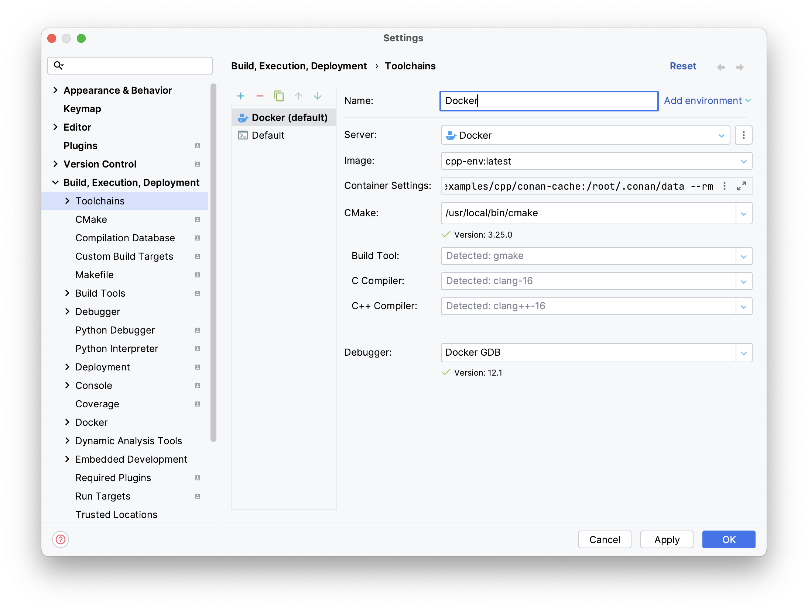

# Data Spree Inference CPP Examples

This directory contains C++ [example code](examples/) for interfacing with Dataspree Inference.

Here you can find three examples:
- **tcp_cli**
- **tcp_tutorial**
- **tcp_playground** 

## Getting Started
To get started with the tutorial and development, we recommend the setup with Docker described here. 
We have prepared a Dockerfile that can be used for remote development in a Docker container. 
This way, you don't have to worry about installations or dependencies and can seamlessly follow the tutorial. 
Here we show an example of the Docker setup with the IDE "CLion" from JetBrains.

### Prerequisites:
1. Install Docker
2. IDE with remote development feature (i.e. CLion)

### Steps:
1. Start Docker
2. Open a new terminal window in the repository subfolder `cpp`.
3. Build the image from the Dockerfile `docker build -t cpp-env --progress=plain .`
4. Create a Docker toolchain/remote connection in your IDE based on our created image with the following settings. 

### Toolchain settings:
Image: `cpp-env:latest`

Run options for the container:
```
-u 1000 --rm -v [/abs-path-to-repo-parent]/examples/cpp/cmake-build-debug:/tmp/cpp/cmake-build-debug -v [/abs-path-to-repo-parent]/examples/cpp/conan-cache:/root/.conan/data
```
- Replace the path in the square brackets with the absolute path to the repository folder on your local machine.

CMake path on remote: `/usr/local/bin/cmake`

Overview:


Done!
